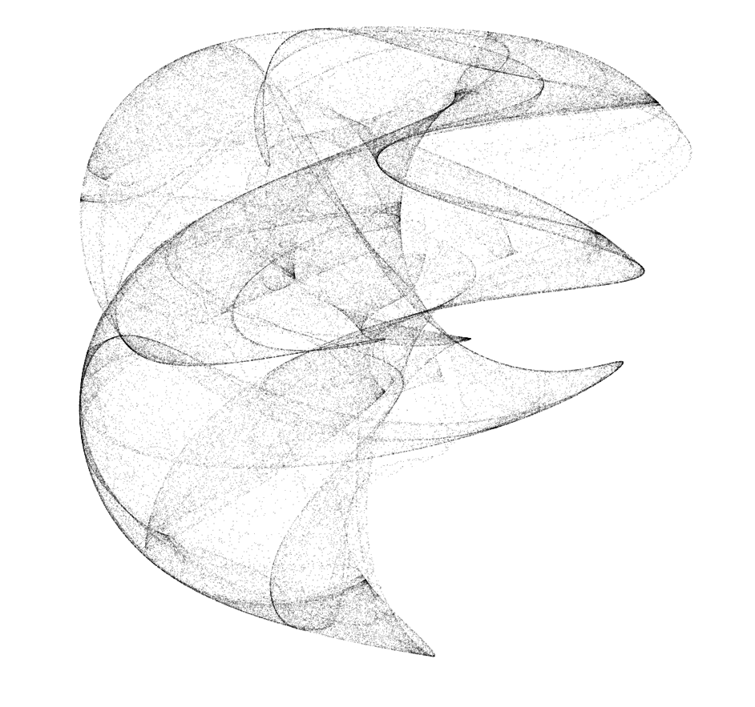

# ga-strange-attractors



inspired by

- [BIT-101: STRANGE ATTRACTOR FLOW FIELDS](https://www.bit-101.com/blog/2021/10/strange-attractor-flow-fields/)

## Getting started: Installation and running

```
yarn
```

Run `esbuild` in watch-mode to watch for changes to recompile

```
yarn watch
```
